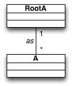
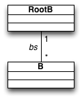

### Bijection (one-to-one)
The [bijection.qvtr](bijection.qvtr) transformation denoted a bijection between two very simple models.

#### Overview
This transformation is part of a series of toy transformations designed to test the expressibility of *Echo*. Metamodels simply consist of sets of uninterpreted *A* and *B* elements, respectively. See also (soon):
* Injection (one-to-some)
* Surjection (some-to-one)
* Function (set-to-one)
* Abstraction (some-to-lone)
* Representation (lone-to-some)
* Injective (lone-to-set)
* Simple (set-to-lone)
* Entire (set-to-some)
* Surjective (some-to-set)
* Relation (set-to-set)

#### Meta-models
| [A.ecore](../../../metamodels/bijection/A.ecore) for *A*s | [B.ecore](../../../metamodels/bijection/B.ecore) for *B*s |
| --- | --- | --- |
|  |  |

#### Models
| [A_example.xmi](../../../models/bijection/A_example.xmi) | [B_example.xmi](../../../models/bijection/B_example.xmi) |
| --- | --- | --- |
|  |  |

#### History
* Still not part of history