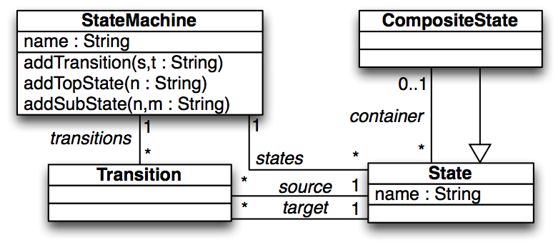
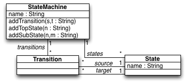
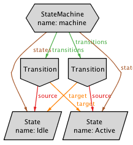

### HSM2NHSM (transitive closure)
The [hsm2nhsm_closure.qvtr](hsm2nhsm_closure.qvtr) transformation specifies the collapse/expansion of state diagrams

#### Overview
Every top-level State on the expanded state diagram is matched to a State in the collapsed state diagram with the same name. Transitions at the expanded sate diagram pushed up from nested States to the top-level States at the collapsed state diagram.

This version of HSM2NHSM relies on the *transitive closure* to retrieve Transitions from nested states. A *resursive* is also available [here](../hsm2nhsm_recursion/).

#### Meta-models
| [HSM.ecore](../../../metamodels/hsm2nhsm/HSM.ecore) for expanded (hierarchical) state diagrams | [NHSM.ecore](../../../metamodels/hsm2nhsm/NHSM.ecore) for collapsed (non-hierarchical) state diagrams |
| --- | --- | --- |
|  |  |

#### Models
| [HSM_example.xmi](../../../models/hsm2nhsm/HSM_example.xmi) | [NHM_example.xmi](../../../models/hsm2nhsm/NHM_example.xmi) |
| --- | --- | --- |
|  |  |

#### History
* This example is based on the running example from the paper *JTL: a bidirectional and change propagating transformation language"* by A. Cicchetti, D. Di Ruscio, R. Eramo and A. Pierantonio.
