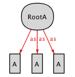
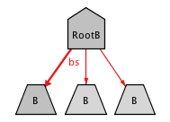

### One-to-one (bijection)
The [one2one.qvtr](one2one.qvtr) transformation denoted a bijection between two very simple models.

#### Overview
This transformation is part of a series of toy transformations designed to test the expressibility of *Echo*. Metamodels simply consist of sets of uninterpreted *A* and *B* elements, respectively. QVT-R is was not designed to handle one-to-one relations, rather QVT-R specifications typically denote some-to-some relations. In order to attain a bijection in this example, since elements are uninterpreted, we must resort to non-common QVT-R specifications, in particular forcing the number of *A* and *B* elements to be the same. This may be troublesome in *Echo* if the bitwidth is not high enough to accommodate the cardinality of the elements.

See also (soon):
* set-to-set (relation)
* set-to-lone (simple)
* set-to-some (entire)
* set-to-one (function)
* lone-to-set (injective)
* lone-to-lone (simple and injective)
* lone-to-some (representation)
* lone-to-one (injection)
* some-to-set (surjective)
* some-to-lone (abstraction)
* some-to-some (surjective and entire)
* some-to-one (surjection)
* one-to-set (injective and surjective)
* one-to-lone (injective abstraction)
* one-to-some (surjective representation)

#### Meta-models
| [A.ecore](../../../metamodels/bijection/A.ecore) for *A*s | [B.ecore](../../../metamodels/bijection/B.ecore) for *B*s |
| --- | --- | --- |
|  |  |

#### Models
| [A_example.xmi](../../../models/bijection/A_example.xmi) | [B_example.xmi](../../../models/bijection/B_example.xmi) |
| --- | --- | --- |
|  |  |

#### History
* Still not part of history