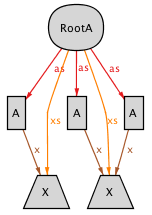

### Some-to-one (surjection)
The [some2one.qvtr](some2one.qvtr) transformation denotes a surjection between two very simple models.

#### Overview
This transformation is part of a series of toy transformations designed to test the expressibility of *Echo*. Metamodel *A* consists of *A* elements containing an extra association of type *X*, while metamodel *B* simply consist of sets of uninterpreted *B* elements, making *A* larger than *B*. QVT-R is not designed to naturally handle one-to-one relations, QVT-R specifications typically denoting some-to-some relations. In order to attain a representation in this example, since elements are uninterpreted, we must resort to non-common QVT-R specifications, in particular forcing the number of *A* and *B* elements to be the same. This may be troublesome in *Echo* if the bitwidth is not sufficient to accommodate the cardinality of the sets.

More in this series:
<table><tr><td><ul>
<li>set-to-set (relation)</li>
<li>set-to-lone (simple)</li>
<li>set-to-some (entire)</li>
<li>set-to-one (function)</li>
<li>lone-to-set (injective)</li>
<li>lone-to-lone (simple and injective)</li>
<li>lone-to-some (representation)</li>
<li>lone-to-one (injection) </li>
<li>some-to-set (surjective)</li>
<li>some-to-lone (abstraction)</li>
<li><a href="../some2some/">some2some</a> (surjective and entire)</li>
<li><a href="../some2one/">some2one</a> (surjection)</li>
<li>one-to-set (injective and surjective)</li>
<li>one-to-lone (injective abstraction)</li>
<li><a href="../one2some/">one2some</a> (surjective representation)</li>
<li><a href="../one2one">one2one</a> (bijection)</li>
</ul></td>
<td>

</td></tr></table>

#### Meta-models
| [A_extended.ecore](../../../metamodels/multiplicities/A_extended.ecore) for extended *A*s | [B_base.ecore](../../../metamodels/multiplicities/B_base.ecore) for empty *B*s |
| --- | --- | --- |
|  |  |

#### Models
| [A_extended_example.xmi](../../../models/multiplicities/A_extended_example.xmi) | [B_base_example.xmi](../../../models/multiplicities/B_base_example.xmi) |
| --- | --- | --- |
|  |  |

#### History
* The taxonomy of these examples is inspired by taxonomy for binary relation from the *Data Transformation by Calculation* tutorial by J. N. Oliveira.
