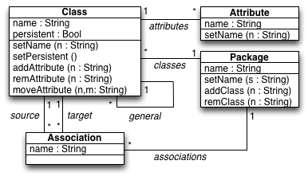

### UML2RDBMS
The [UML2RDBMS.qvtr](uml2rdbms_keys.qvtr) transformation is a simplified version of the classical object-relational mapping, between class diagrams and database schemes, used as a running example in the QVT standard.

#### Overview
Every persistent Class on the UML class diagram is matched to a Table in the relational database scheme, with a Column for every Attribute, including those inherited from super-classes. Associations between classes are mapped to foreign keys.

#### Meta-models
| [UML.ecore](../../../metamodels/uml2rdbms_keys/UML.ecore) for UML class diagrams | [RDBMS.ecore](../../../metamodels/uml2rdbms_keys/RDBMS.ecore) for relational database schemes |
| --- | --- | --- |
|  |  |

#### History
* This example is a simplified version of the example illustrating the *MOF 2.0 Query/View/Transformation Specification*. 
* This example has been used to illustrate the *Model repair and transformation with Echo* paper, by N. Macedo, T. Guimarães and A. Cunha.
