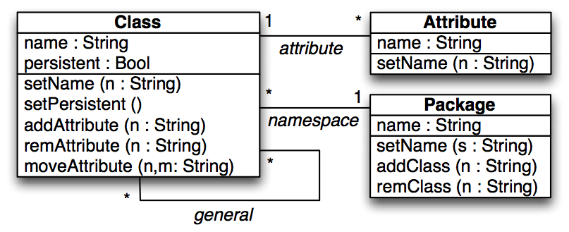
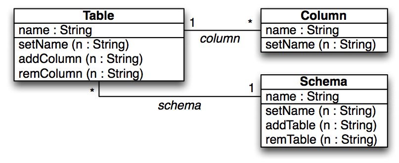
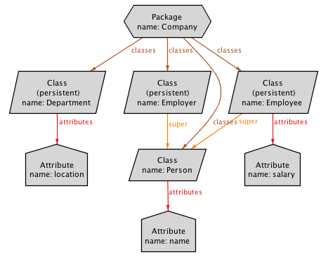
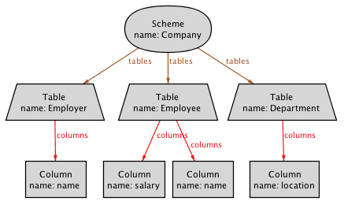

### UML2RDBMS (simplified)
The [UML2RDBMS.qvtr](uml2rdbms_simple.qvtr) transformation is a simplified version of the classical object-relational mapping, between class diagrams and database schemes, used as a running example in the QVT standard.

#### Overview
Every persistent Class on the UML class diagram is matched to a Table in the relational database scheme, with a Column for every Attribute, including those inherited from super-classes.

#### Meta-models
| [UML.ecore](../../../metamodels/uml2rdbms_simple/UML.ecore) for UML class diagrams (without associations) | [RDBMS.ecore](../../../metamodels/uml2rdbms_simple/RDBMS.ecore) for relational database schemes (without keys) |
| --- | --- | --- |
|  |  |

#### Models
| [UML_Company.xmi](../../../models/uml2rdbms_simple/UML_Company.xmi) | [RDB_example.xmi](../../../models/uml2rdbms_simple/RDB_Company.xmi) |
| --- | --- | --- |
|  |  |

#### History
* This example is a simplified version of the example illustrating the *MOF 2.0 Query/View/Transformation Specification*.
* This example has been used to illustrate the *Implementing QVT-R Bidirectional Model Transformations Using Alloy* paper, by N. Macedo and A. Cunha.
* This example has been used in the Echo demonstration [video](vimeo.com/67716977/).
* This example is used as a running example in the submitted paper *Least-change Bidirectional Model Transformation with QVT-R and ATL* by N. Macedo and A. Cunha.
